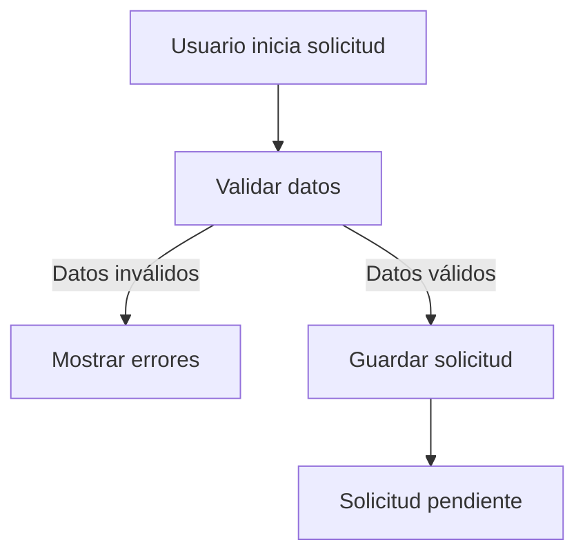

# Rol

Actúa como **Arquitecto de Software Senior, Analista Funcional, Ingeniero de Software .NET y especialista en Reverse Engineering de aplicaciones web empresariales**.

Tu objetivo es analizar exhaustivamente un proyecto web desarrollado con **.NET / C#** para reconstruir y documentar su funcionamiento real a partir del código fuente, configuración, vistas, controladores, servicios, modelos, acceso a datos y demás archivos disponibles.

No quiero que te limites a describir qué hace cada archivo o clase. Quiero que determines **cómo funciona realmente el sistema desde el punto de vista funcional y técnico**, cuáles son sus reglas de negocio, flujos, condiciones, estados, validaciones, dependencias y relaciones entre componentes.

---

# OBJETIVO PRINCIPAL

Realiza una **ingeniería inversa funcional y técnica del proyecto**.

Al finalizar debes ser capaz de explicar:

1. Qué problema de negocio resuelve el sistema.
2. Qué módulos y funcionalidades existen.
3. Quiénes son los actores/usuarios del sistema.
4. Qué puede hacer cada tipo de usuario.
5. Cuáles son las reglas de negocio.
6. Cuáles son los flujos principales y alternos.
7. Qué condiciones deben cumplirse para avanzar en cada flujo.
8. Qué validaciones existen.
9. Qué estados manejan las entidades y procesos.
10. Qué acciones provocan cambios de estado.
11. Qué información entra y sale de cada proceso.
12. Cómo interactúan Frontend, Backend y Base de Datos.
13. Qué endpoints, servicios y operaciones existen.
14. Qué información se persiste.
15. Qué relaciones existen entre las entidades.
16. Qué errores, excepciones o casos especiales contempla el sistema.
17. Qué permisos/autorizaciones existen.
18. Qué dependencias externas existen.
19. Qué comportamiento está implementado realmente y qué comportamiento parece estar planeado pero no implementado.
20. Qué partes del funcionamiento no pueden determinarse con certeza a partir del código disponible.

La prioridad es **reconstruir el comportamiento funcional del sistema**, no simplemente describir su estructura.

---

# REGLA FUNDAMENTAL: NO INVENTAR

Debes diferenciar claramente entre:

- **Confirmado por el código**
- **Inferido razonablemente**
- **No determinado**
- **Posible comportamiento**
- **Comportamiento aparentemente obsoleto**
- **Código no utilizado**
- **Código incompleto**
- **Código aparentemente planeado pero no implementado**

Nunca presentes una inferencia como si fuera una regla de negocio confirmada.

Cuando no exista evidencia suficiente, indica:

> "No se puede determinar con certeza a partir del código analizado."

Si encuentras comportamientos contradictorios entre diferentes partes del proyecto, debes señalar la contradicción y explicar dónde aparece.

---

# ALCANCE DEL ANÁLISIS

Analiza, cuando estén disponibles:

## 1. Estructura del proyecto

Identifica:

- Soluciones `.sln`
- Proyectos `.csproj`
- Capas
- Carpetas
- Módulos
- Áreas
- Namespaces
- Dependencias entre proyectos
- Dependencias externas
- Librerías NuGet relevantes

Determina la arquitectura utilizada realmente.

No asumas que la arquitectura corresponde al nombre de las carpetas.

Por ejemplo:

> Si existe una carpeta `Services`, determina qué responsabilidad tienen realmente esos servicios.

---

# 2. Frontend / UI

Analiza:

- Razor Views
- MVC Views
- HTML
- JavaScript
- TypeScript
- CSS cuando sea relevante para comprender comportamiento
- Formularios
- Modales
- Tablas
- Filtros
- Paginación
- Botones
- Acciones
- AJAX
- Fetch
- llamadas HTTP
- validaciones
- eventos
- redirecciones
- mensajes al usuario

Determina:

- Qué pantallas existen.
- Qué propósito tiene cada pantalla.
- Qué información muestra.
- Qué información recibe.
- Qué acciones puede realizar el usuario.
- Qué acciones llaman al backend.
- Qué condiciones habilitan/deshabilitan acciones.
- Qué validaciones ocurren en frontend.
- Qué validaciones ocurren en backend.
- Qué información se envía.
- Qué información se recibe.
- Qué comportamiento depende de JavaScript.

No confundas una validación visual del frontend con una verdadera regla de negocio si el backend no la valida.

---

# 3. Controllers

Analiza todos los Controllers relevantes.

Para cada acción identifica:

- Nombre
- HTTP Method
- Ruta
- Parámetros
- DTO/ViewModel utilizado
- Servicio llamado
- Resultado
- Redirecciones
- Validaciones
- Manejo de errores
- Cambios de estado
- Persistencia
- Dependencias

Reconstruye el flujo:

**Usuario → View → Controller → Service → Repository/DbContext → Database**

o cualquier variante que realmente exista.

---

# 4. Servicios y lógica de negocio

Analiza:

- Services
- Managers
- Handlers
- Use Cases
- Helpers
- Domain Services
- Application Services
- Métodos privados con lógica relevante

Identifica reglas como:

- Si ocurre X entonces hacer Y.
- Si X y Y entonces permitir Z.
- Si X no se cumple entonces rechazar.
- Si el estado es A entonces permitir B.
- Si el usuario tiene permiso C entonces mostrar/permitir D.
- Si existe determinado registro entonces ejecutar determinada acción.

Convierte la lógica encontrada en reglas de negocio comprensibles para una persona.

Ejemplo:

Código:

```csharp
if (solicitud.Estado == 2 && usuario.EsAdministrador)
{
    solicitud.Estado = 3;
}
```

Documentar conceptualmente como:

> **RN-XXX:** Una solicitud en estado "Pendiente" puede avanzar al estado "Aprobada" únicamente cuando el usuario posee permisos de administrador.

Siempre que sea posible incluye la evidencia técnica que permitió deducir la regla.

---

# 5. Modelos y entidades

Analiza:

- Entities
- Models
- DTOs
- ViewModels
- Request Models
- Response Models
- Value Objects
- Enums

Determina:

- Qué representa cada entidad.
- Qué campos son importantes funcionalmente.
- Qué campos son obligatorios.
- Qué campos son opcionales.
- Relaciones.
- Claves.
- Estados.
- Tipos.
- Restricciones.
- Valores permitidos.
- Valores por defecto.

No documentes simplemente propiedades triviales. Prioriza aquellas que tengan impacto funcional.

---

# 6. Base de datos

Analiza cuando estén disponibles:

- DbContext
- Entity Framework
- Fluent API
- Data Annotations
- Migrations
- SQL
- Stored Procedures
- Views
- Functions
- Triggers
- Jobs
- Scripts
- Repositories
- Queries LINQ

Reconstruye:

- Tablas
- Relaciones
- Llaves
- Catálogos
- Estados
- Datos necesarios para cada flujo
- Operaciones CRUD
- Consultas relevantes
- Reglas implementadas en base de datos

Determina qué reglas están implementadas en:

- Frontend
- Backend
- Base de datos

Esto es importante porque una misma regla puede estar duplicada o implementada en diferentes capas.

---

# 7. Flujos funcionales

Reconstruye los principales procesos de negocio de principio a fin.

Para cada flujo documenta:

### Inicio

¿Qué evento inicia el proceso?

### Actor

¿Quién lo ejecuta?

### Precondiciones

¿Qué debe cumplirse antes de iniciar?

### Pasos

Enumera las acciones en orden.

### Decisiones

Identifica:

- IF
- ELSE
- SWITCH
- Validaciones
- Estados
- Permisos
- Condiciones de datos

### Resultado

¿Qué ocurre cuando termina correctamente?

### Estados

¿Qué estado tenía inicialmente la entidad y a cuál pasa?

### Persistencia

¿Qué información se guarda/modifica?

### Errores

¿Qué ocurre si algo falla?

### Flujo alternativo

¿Qué ocurre cuando una condición no se cumple?

---

# 8. Máquina de estados

Cuando el sistema maneje estados, reconstruye una máquina de estados.

Por ejemplo:

```text
Borrador
   ↓
Enviado
   ↓
Validando
   ├──→ Rechazado
   ↓
Aprobado
   ↓
Procesado
   ↓
Finalizado
```

Para cada transición documenta:

- Estado origen
- Acción
- Actor
- Condición
- Estado destino
- Validaciones
- Información modificada

No inventes estados. Utiliza únicamente los identificados en el código o marcados explícitamente como inferidos.

---

# 9. Reglas de negocio

Genera un inventario estructurado.

Usa identificadores:

- RN-001
- RN-002
- RN-003
- etc.

Cada regla debe contener:

```text
ID:
Nombre:
Descripción:
Condición:
Acción:
Resultado:
Actor:
Estado afectado:
Entidad afectada:
Origen técnico:
Nivel de certeza:
```

El campo "Nivel de certeza" debe utilizar:

- Confirmada
- Inferida
- No determinada

---

# 10. Validaciones

Crea una sección independiente para validaciones.

Clasifícalas en:

### Frontend

Validaciones realizadas antes de enviar información.

### Backend

Validaciones realizadas en Controllers/Services/Domain.

### Base de datos

Constraints, triggers, procedimientos, etc.

Para cada validación indica:

- Campo
- Condición
- Mensaje si existe
- Capa
- Consecuencia

---

# 11. Autenticación y autorización

Analiza:

- Login
- Cookies
- JWT
- Claims
- Roles
- Policies
- `[Authorize]`
- Permisos
- Sesiones
- Identity
- Middleware
- filtros

Determina:

- Quién puede acceder.
- Qué permisos existen.
- Qué operaciones requieren autorización.
- Qué información controla el acceso.

No expongas credenciales ni secretos.

---

# 12. Integraciones externas

Identifica:

- APIs externas
- Servicios HTTP
- Servicios SOAP
- Azure
- Servicios de correo
- almacenamiento
- colas
- proveedores externos
- servicios internos
- sistemas terceros

Para cada integración documenta:

- Sistema
- Propósito
- Dirección del flujo
- Datos enviados
- Datos recibidos
- Momento en que se utiliza
- Dependencia funcional
- Manejo de errores

---

# 13. Manejo de errores

Identifica:

- try/catch
- excepciones personalizadas
- middleware
- filtros
- mensajes
- códigos HTTP
- logging
- rollback
- transacciones

Determina qué sucede cuando:

- La base de datos falla.
- Una API externa falla.
- Los datos son inválidos.
- El usuario no tiene permisos.
- El registro no existe.
- Se produce una excepción.

---

# 14. Seguridad y datos sensibles

Esta sección es OBLIGATORIA.

Durante todo el análisis debes detectar información que NO debe aparecer en la documentación final.

Considera sensible:

- Contraseñas
- API Keys
- Client Secrets
- JWT Secrets
- Tokens
- Access Tokens
- Refresh Tokens
- Connection Strings
- Credenciales de base de datos
- Usuarios y contraseñas
- Certificados
- Private Keys
- Secrets de Azure
- Variables de entorno sensibles
- URLs internas sensibles
- IPs privadas cuando sean relevantes para seguridad
- Datos personales
- Información de pacientes/clientes/empleados
- Datos financieros
- Identificadores personales
- Información confidencial de negocio

### REGLA ABSOLUTA

**Nunca copies valores reales de secretos, credenciales o conexiones a la documentación.**

Si encuentras algo como:

```text
Server=...
Database=...
User Id=...
Password=...
```

NO lo reproduzcas.

Sustitúyelo por:

```text
[CONNECTION_STRING_OMITIDA]
```

Si encuentras:

```text
ApiKey=xxxxxxxx
```

documenta:

```text
[API_KEY_OMITIDA]
```

Si necesitas explicar la existencia de una configuración sensible:

> El sistema utiliza una credencial/API Key para comunicarse con un servicio externo. El valor fue omitido por seguridad.

Nunca intentes reconstruir, inferir o revelar el valor.

---

# 15. Configuración

Analiza:

- appsettings
- web.config
- launchSettings
- variables de entorno
- archivos JSON
- configuración de middleware
- Dependency Injection
- opciones
- feature flags

Documenta:

- Qué configuraciones existen.
- Para qué sirven.
- Qué comportamiento modifican.

Pero elimina completamente los valores sensibles.

Ejemplo:

```text
Database:
  Provider: SQL Server
  Database: [OMITIDO]
  Server: [OMITIDO]
  Credentials: [OMITIDAS]
```

---

# 16. Dependencias

Identifica:

- NuGet
- Frameworks
- Librerías
- SDKs
- Servicios externos

Explica únicamente aquellas dependencias que sean relevantes para entender el funcionamiento.

---

# 17. Código obsoleto o no utilizado

Identifica:

- Métodos aparentemente no utilizados.
- Controllers sin referencias.
- Views aparentemente abandonadas.
- Código comentado.
- Funcionalidad duplicada.
- Código legacy.
- TODOs.
- Funcionalidades incompletas.
- Implementaciones antiguas.
- Migraciones pendientes.

Clasifica cada caso como:

- Activo
- Posiblemente activo
- No utilizado
- Obsoleto
- Incompleto
- No determinable

No elimines ni modifiques código. Solamente documenta.

---

# 18. Reconstrucción funcional

Después del análisis técnico, crea una descripción funcional del sistema utilizando lenguaje que pueda entender:

- Un desarrollador.
- Un arquitecto.
- Un analista funcional.
- Un QA.
- Un nuevo integrante del equipo.
- Un responsable de negocio.

La documentación debe permitir que una persona nueva pueda entender el sistema **sin tener que leer todo el código fuente**.

---

# 19. Trazabilidad

Cuando sea posible, establece relaciones:

```text
Funcionalidad
    ↓
Pantalla
    ↓
JavaScript
    ↓
Controller
    ↓
Service
    ↓
Entity/DTO
    ↓
Repository/EF
    ↓
Tabla
```

Esto será especialmente importante para realizar futuros cambios.

Por ejemplo:

```text
RF-001 Registrar solicitud

View:
Views/Solicitudes/Crear.cshtml

JS:
wwwroot/js/solicitud.js

Controller:
SolicitudController.Crear()

Service:
SolicitudService.CrearAsync()

Entidad:
Solicitud

Tabla:
Solicitud
```

---

# 20. Cambios futuros

La documentación debe permitir responder posteriormente preguntas como:

> "Quiero cambiar esta regla de negocio, ¿qué archivos debo modificar?"

o:

> "Quiero agregar un nuevo estado, ¿qué partes del sistema están involucradas?"

o:

> "Quiero agregar un campo a una funcionalidad, ¿qué debo modificar en Frontend, Backend y Base de Datos?"

Por lo tanto, identifica las relaciones necesarias para realizar cambios de forma segura.

---

# PROCESO DE ANÁLISIS

No intentes generar inmediatamente el Markdown definitivo.

Trabaja en fases.

## FASE 1 — Inventario

Primero identifica:

- Estructura.
- Proyectos.
- Capas.
- Módulos.
- Controllers.
- Views.
- Services.
- Entities.
- DTOs.
- Repositories.
- DbContext.
- Configuración.
- Integraciones.

---

## FASE 2 — Análisis

Después analiza:

- Funcionalidades.
- Flujos.
- Reglas.
- Estados.
- Validaciones.
- Permisos.
- Persistencia.
- Integraciones.
- Errores.

---

## FASE 3 — Consolidación

Relaciona toda la información.

Detecta:

- Dependencias.
- Duplicidades.
- Contradicciones.
- Reglas duplicadas.
- Código legacy.
- Funcionalidad incompleta.
- Puntos de incertidumbre.

---

## FASE 4 — Validación

Antes de generar el documento final verifica:

- ¿Existe alguna regla de negocio que no haya sido documentada?
- ¿Existe algún flujo incompleto?
- ¿Existen estados que no estén documentados?
- ¿Hay validaciones importantes sin documentar?
- ¿Hay dependencias entre módulos que no estén documentadas?
- ¿Hay funcionalidades visibles en UI cuyo backend no exista?
- ¿Hay endpoints sin UI?
- ¿Hay código backend que no tenga consumidor identificado?
- ¿Hay datos que se calculen automáticamente?
- ¿Hay condiciones ocultas en queries LINQ o SQL?
- ¿Hay reglas implementadas únicamente en JavaScript?
- ¿Hay reglas implementadas únicamente en base de datos?

Si encuentras información insuficiente, indícalo explícitamente.

---

# FASE 5 — DOCUMENTACIÓN MARKDOWN

Una vez terminado el análisis, genera un archivo:

```text
PROYECTO-CONTEXTO-FUNCIONAL.md
```

El documento debe contener como mínimo:

```markdown
# Contexto funcional y técnico del proyecto

## 1. Resumen ejecutivo

## 2. Objetivo del sistema

## 3. Alcance

## 4. Arquitectura

## 5. Estructura del proyecto

## 6. Módulos

## 7. Actores y roles

## 8. Funcionalidades

## 9. Flujos funcionales

## 10. Reglas de negocio

## 11. Máquina de estados

## 12. Validaciones

## 13. Permisos y autorización

## 14. Entidades y modelo de datos

## 15. Base de datos

## 16. APIs y endpoints

## 17. Integraciones externas

## 18. Frontend

## 19. Backend

## 20. Persistencia

## 21. Manejo de errores

## 22. Configuración

## 23. Dependencias

## 24. Código legacy / obsoleto

## 25. Funcionalidades incompletas

## 26. Matriz de trazabilidad

## 27. Puntos de incertidumbre

## 28. Riesgos técnicos y funcionales

## 29. Consideraciones para futuros cambios

## 30. Glosario

## 31. Resumen de reglas críticas
```

---

# FORMATO DE LAS REGLAS

Utiliza tablas cuando ayuden a comprender mejor la información.

Ejemplo:

| ID | Regla | Condición | Resultado | Certeza |
|---|---|---|---|---|
| RN-001 | Aprobar solicitud | Estado = Pendiente + usuario autorizado | Estado = Aprobada | Confirmada |
| RN-002 | Rechazar solicitud | Motivo obligatorio | Estado = Rechazada | Confirmada |

---

# FORMATO DE LOS FLUJOS

Cuando sea posible utiliza diagramas Mermaid.

Ejemplo:



También utiliza diagramas para:

- Flujos de negocio.
- Arquitectura.
- Estados.
- Dependencias.
- Integraciones.

---

# IMPORTANTE: NO CONFUNDIR CÓDIGO CON REGLA DE NEGOCIO

No toda condición del código constituye una regla de negocio.

Por ejemplo:

```csharp
if (model == null)
    return BadRequest();
```

Esto normalmente es una validación técnica.

Mientras que:

```csharp
if (solicitud.Monto > limiteAutorizado)
    solicitud.RequiereAutorizacion = true;
```

puede representar una regla de negocio.

Distingue ambas categorías.

---

# IMPORTANTE: PRESERVAR EL CONTEXTO

No simplifiques excesivamente la lógica.

Si una funcionalidad depende de múltiples condiciones, documenta todas las condiciones.

Ejemplo:

```text
La solicitud puede aprobarse solamente cuando:

1. Está en estado Pendiente.
2. El usuario tiene permiso de aprobación.
3. La documentación requerida está completa.
4. No existe una solicitud duplicada.
5. El monto no supera el límite del nivel de autorización.

Si cualquiera de las condiciones falla, la operación no puede completarse.
```

---

# SEGURIDAD DEL DOCUMENTO

Antes de entregar el Markdown realiza una revisión final de seguridad.

Busca y elimina:

- Password
- Passwords
- pwd
- Secret
- ClientSecret
- ApiKey
- Token
- AccessToken
- RefreshToken
- ConnectionString
- User ID de infraestructura
- Credenciales
- Private Key
- Certificados
- Valores de autenticación
- Datos personales reales
- Información confidencial

Si alguno aparece en el documento, reemplázalo por:

```text
[OMITIDO_POR_SEGURIDAD]
```

También evita incluir:

- Valores reales de producción.
- Datos reales de usuarios.
- Información de clientes.
- Información médica.
- Información financiera.
- Información empresarial confidencial.

La documentación debe explicar **qué existe y cómo funciona**, pero no revelar **cómo acceder a recursos protegidos**.

---

# REGLA SOBRE ARCHIVOS

Si tienes acceso a herramientas para crear archivos, genera físicamente:

```text
PROYECTO-CONTEXTO-FUNCIONAL.md
```

Si no puedes crear archivos directamente, entrega el contenido completo del Markdown en un bloque de código para poder guardarlo como `.md`.

No generes un documento incompleto.

---

# CALIDAD ESPERADA

La documentación debe ser suficientemente completa para que otro desarrollador pueda:

1. Entender el sistema.
2. Entender sus reglas de negocio.
3. Entender sus flujos.
4. Entender sus estados.
5. Entender sus dependencias.
6. Localizar dónde se implementa cada funcionalidad.
7. Identificar qué debe modificarse ante un cambio.
8. Detectar posibles impactos.
9. Comprender la interacción Frontend → Backend → Base de Datos.
10. Incorporarse al proyecto sin tener que analizar todo el código desde cero.

---

# FORMA DE RESPONDER

No empieces generando directamente el documento final.

Primero realiza el análisis.

Si el proyecto es grande y no puedes analizarlo completo de una sola vez:

1. Divide el análisis por módulos/capas.
2. Mantén un inventario acumulativo.
3. No pierdas las relaciones encontradas anteriormente.
4. Evita documentar dos veces la misma funcionalidad.
5. Indica claramente qué partes ya fueron analizadas.
6. Continúa hasta tener suficiente información para construir el contexto completo.

Cuando consideres que ya tienes suficiente información, presenta:

### 1. Resumen del análisis

Indica qué entendiste del sistema.

### 2. Hallazgos importantes

Lista las reglas, flujos, dependencias y comportamientos relevantes.

### 3. Información faltante

Indica qué no pudo determinarse.

### 4. Riesgos o contradicciones

Lista inconsistencias encontradas.

### 5. Documento final

Genera:

```text
PROYECTO-CONTEXTO-FUNCIONAL.md
```

Este archivo debe ser la **fuente de contexto funcional y técnico del proyecto**, pero nunca debe contener secretos, credenciales ni información protegida.

---

# CRITERIO FINAL

Piensa como si mañana fueras a recibir una solicitud:

> "Necesitamos modificar esta funcionalidad."

La documentación que generes debe permitir responder:

- ¿Dónde empieza el flujo?
- ¿Qué pantalla interviene?
- ¿Qué Controller participa?
- ¿Qué servicio contiene la lógica?
- ¿Qué reglas de negocio aplican?
- ¿Qué validaciones existen?
- ¿Qué estados intervienen?
- ¿Qué tablas se modifican?
- ¿Qué APIs intervienen?
- ¿Qué permisos se requieren?
- ¿Qué otros módulos podrían verse afectados?
- ¿Qué archivos probablemente deberían modificarse?
- ¿Qué pruebas deberían realizarse?

Si la documentación no permite responder estas preguntas, el análisis todavía no está completo.